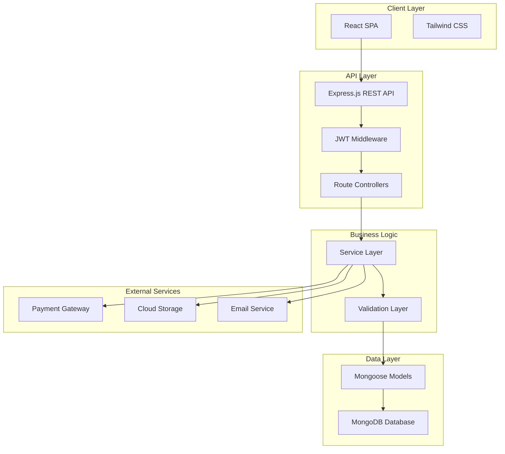

# MultiMart Design Document

## Overview

MultiMart is a full-stack multi-vendor e-commerce platform built with a modern tech stack. The architecture follows a client-server model with a React frontend, Node.js/Express backend, and MongoDB database. The system is designed for scalability, security, and optimal user experience across all user roles (customers, vendors, and admins).

### Technology Stack

- **Frontend**: React.js 18+ with Tailwind CSS for styling
- **Backend**: Node.js with Express.js framework
- **Database**: MongoDB with Mongoose ODM
- **Authentication**: JWT (JSON Web Tokens) with bcrypt for password hashing
- **Payment Integration**: Paystack, Flutterwave, or Stripe SDK
- **Image Storage**: Cloudinary or Firebase Storage
- **Hosting**: 
  - Frontend: Vercel or Netlify
  - Backend: Render, Railway, or AWS
- **Email Service**: SendGrid or NodeMailer with SMTP

## Architecture

### High-Level Architecture



### System Components

1. **Frontend Application (React SPA)**
   - Component-based architecture with React hooks
   - State management using Context API or Redux Toolkit
   - React Router for client-side routing
   - Axios for API communication
   - Responsive design with Tailwind CSS

2. **Backend API (Express.js)**
   - RESTful API design
   - Middleware for authentication, validation, and error handling
   - Controller-Service-Repository pattern
   - JWT-based stateless authentication

3. **Database (MongoDB)**
   - Document-based NoSQL database
   - Collections for users, vendors, stores, products, orders, reviews, etc.
   - Indexes for optimized queries

4. **External Services**
   - Payment gateway for transaction processing
   - Cloud storage for images and media
   - Email service for notifications

## Components and Interfaces

### Frontend Components Structure

```
src/
├── components/
│   ├── common/
│   │   ├── Header.jsx
│   │   ├── Footer.jsx
│   │   ├── Navbar.jsx
│   │   ├── SearchBar.jsx
│   │   ├── Button.jsx
│   │   ├── Modal.jsx
│   │   └── Loader.jsx
│   ├── product/
│   │   ├── ProductCard.jsx
│   │   ├── ProductGrid.jsx
│   │   ├── ProductDetails.jsx
│   │   ├── ProductFilter.jsx
│   │   └── ProductReviews.jsx
│   ├── cart/
│   │   ├── CartItem.jsx
│   │   ├── CartSummary.jsx
│   │   └── CheckoutForm.jsx
│   ├── vendor/
│   │   ├── VendorDashboard.jsx
│   │   ├── ProductForm.jsx
│   │   ├── OrderList.jsx
│   │   └── StoreProfile.jsx
│   └── admin/
│       ├── AdminDashboard.jsx
│       ├── UserManagement.jsx
│       ├── VendorManagement.jsx
│       └── Analytics.jsx
├── pages/
│   ├── Home.jsx
│   ├── Login.jsx
│   ├── Register.jsx
│   ├── Products.jsx
│   ├── ProductDetail.jsx
│   ├── Cart.jsx
│   ├── Checkout.jsx
│   ├── Orders.jsx
│   ├── Wishlist.jsx
│   ├── VendorPortal.jsx
│   └── AdminPortal.jsx
├── context/
│   ├── AuthContext.jsx
│   ├── CartContext.jsx
│   └── ThemeContext.jsx
├── services/
│   ├── api.js
│   ├── authService.js
│   ├── productService.js
│   ├── orderService.js
│   └── paymentService.js
├── utils/
│   ├── validators.js
│   ├── formatters.js
│   └── constants.js
└── App.jsx
```

### Backend API Structure

```
src/
├── config/
│   ├── database.js
│   ├── cloudinary.js
│   └── payment.js
├── models/
│   ├── User.js
│   ├── Vendor.js
│   ├── Store.js
│   ├── Product.js
│   ├── Order.js
│   ├── Review.js
│   ├── Category.js
│   └── Wishlist.js
├── controllers/
│   ├── authController.js
│   ├── userController.js
│   ├── vendorController.js
│   ├── productController.js
│   ├── orderController.js
│   ├── reviewController.js
│   ├── cartController.js
│   ├── paymentController.js
│   └── adminController.js
├── services/
│   ├── authService.js
│   ├── emailService.js
│   ├── paymentService.js
│   ├── imageService.js
│   └── analyticsService.js
├── middleware/
│   ├── auth.js
│   ├── roleCheck.js
│   ├── validation.js
│   ├── errorHandler.js
│   └── upload.js
├── routes/
│   ├── authRoutes.js
│   ├── userRoutes.js
│   ├── vendorRoutes.js
│   ├── productRoutes.js
│   ├── orderRoutes.js
│   ├── reviewRoutes.js
│   ├── cartRoutes.js
│   ├── paymentRoutes.js
│   └── adminRoutes.js
├── utils/
│   ├── validators.js
│   ├── helpers.js
│   └── constants.js
└── server.js
```

### API Endpoints

#### Authentication & User Management
- `POST /api/auth/register` - Register new user
- `POST /api/auth/login` - User login
- `POST /api/auth/logout` - User logout
- `POST /api/auth/forgot-password` - Request password reset
- `POST /api/auth/reset-password` - Reset password with token
- `GET /api/users/profile` - Get user profile
- `PUT /api/users/profile` - Update user profile
- `GET /api/users/orders` - Get user order history

#### Vendor Management
- `POST /api/vendors/register` - Register as vendor
- `GET /api/vendors/:id` - Get vendor details
- `PUT /api/vendors/:id` - Update vendor profile
- `POST /api/vendors/store` - Create store
- `PUT /api/vendors/store/:id` - Update store details
- `GET /api/vendors/orders` - Get vendor orders
- `GET /api/vendors/analytics` - Get vendor sales analytics

#### Product Management
- `GET /api/products` - Get all products (with filters)
- `GET /api/products/:id` - Get product details
- `POST /api/products` - Create product (vendor only)
- `PUT /api/products/:id` - Update product (vendor only)
- `DELETE /api/products/:id` - Delete product (vendor only)
- `GET /api/products/category/:category` - Get products by category
- `GET /api/products/search?q=query` - Search products

#### Cart Management
- `GET /api/cart` - Get user cart
- `POST /api/cart/add` - Add item to cart
- `PUT /api/cart/update/:itemId` - Update cart item quantity
- `DELETE /api/cart/remove/:itemId` - Remove item from cart
- `DELETE /api/cart/clear` - Clear cart

#### Order Management
- `POST /api/orders` - Create order
- `GET /api/orders/:id` - Get order details
- `PUT /api/orders/:id/status` - Update order status (vendor/admin)
- `PUT /api/orders/:id/cancel` - Cancel order
- `GET /api/orders/user/:userId` - Get user orders

#### Payment Processing
- `POST /api/payments/initialize` - Initialize payment
- `POST /api/payments/verify` - Verify payment
- `POST /api/payments/webhook` - Payment webhook handler

#### Reviews & Ratings
- `GET /api/reviews/product/:productId` - Get product reviews
- `POST /api/reviews` - Create review
- `PUT /api/reviews/:id` - Update review
- `DELETE /api/reviews/:id` - Delete review

#### Wishlist
- `GET /api/wishlist` - Get user wishlist
- `POST /api/wishlist/add` - Add to wishlist
- `DELETE /api/wishlist/remove/:productId` - Remove from wishlist

#### Admin Management
- `GET /api/admin/dashboard` - Get dashboard analytics
- `GET /api/admin/users` - Get all users
- `PUT /api/admin/users/:id/status` - Update user status
- `GET /api/admin/vendors` - Get all vendors
- `PUT /api/admin/vendors/:id/approve` - Approve vendor
- `PUT /api/admin/vendors/:id/reject` - Reject vendor
- `GET /api/admin/products` - Get all products
- `DELETE /api/admin/products/:id` - Remove product
- `GET /api/admin/categories` - Get all categories
- `POST /api/admin/categories` - Create category
- `PUT /api/admin/categories/:id` - Update category
- `DELETE /api/admin/categories/:id` - Delete category

## Data Models

### User Model
```javascript
{
  _id: ObjectId,
  firstName: String (required),
  lastName: String (required),
  email: String (required, unique, indexed),
  password: String (required, hashed),
  role: String (enum: ['customer', 'vendor', 'admin'], default: 'customer'),
  phone: String,
  avatar: String (URL),
  addresses: [{
    street: String,
    city: String,
    state: String,
    country: String,
    zipCode: String,
    isDefault: Boolean
  }],
  isVerified: Boolean (default: false),
  isActive: Boolean (default: true),
  resetPasswordToken: String,
  resetPasswordExpire: Date,
  createdAt: Date,
  updatedAt: Date
}
```

### Vendor Model
```javascript
{
  _id: ObjectId,
  userId: ObjectId (ref: 'User', required),
  businessName: String (required),
  businessEmail: String (required),
  businessPhone: String (required),
  taxId: String (required),
  businessAddress: {
    street: String,
    city: String,
    state: String,
    country: String,
    zipCode: String
  },
  documents: [{
    type: String,
    url: String,
    uploadedAt: Date
  }],
  verificationStatus: String (enum: ['pending', 'approved', 'rejected'], default: 'pending'),
  rejectionReason: String,
  isActive: Boolean (default: true),
  createdAt: Date,
  updatedAt: Date
}
```

### Store Model
```javascript
{
  _id: ObjectId,
  vendorId: ObjectId (ref: 'Vendor', required),
  name: String (required, unique, indexed),
  slug: String (required, unique, indexed),
  description: String,
  logo: String (URL),
  banner: String (URL),
  contactEmail: String,
  contactPhone: String,
  socialLinks: {
    facebook: String,
    instagram: String,
    twitter: String
  },
  rating: Number (default: 0),
  totalReviews: Number (default: 0),
  totalProducts: Number (default: 0),
  totalSales: Number (default: 0),
  isActive: Boolean (default: true),
  createdAt: Date,
  updatedAt: Date
}
```

### Product Model
```javascript
{
  _id: ObjectId,
  storeId: ObjectId (ref: 'Store', required, indexed),
  vendorId: ObjectId (ref: 'Vendor', required, indexed),
  name: String (required, indexed),
  slug: String (required, unique, indexed),
  description: String (required),
  category: ObjectId (ref: 'Category', required, indexed),
  price: Number (required, min: 0),
  discountPercentage: Number (default: 0, min: 0, max: 100),
  finalPrice: Number (calculated),
  images: [String] (URLs, max: 5),
  specifications: [{
    key: String,
    value: String
  }],
  stock: Number (required, default: 0, min: 0),
  sku: String (unique),
  status: String (enum: ['active', 'inactive', 'out_of_stock'], default: 'active', indexed),
  rating: Number (default: 0),
  totalReviews: Number (default: 0),
  totalSales: Number (default: 0),
  tags: [String],
  isActive: Boolean (default: true),
  createdAt: Date,
  updatedAt: Date
}
```

### Category Model
```javascript
{
  _id: ObjectId,
  name: String (required, unique),
  slug: String (required, unique, indexed),
  description: String,
  icon: String (URL),
  parentCategory: ObjectId (ref: 'Category'),
  isActive: Boolean (default: true),
  createdAt: Date,
  updatedAt: Date
}
```

### Order Model
```javascript
{
  _id: ObjectId,
  orderNumber: String (required, unique, indexed),
  customerId: ObjectId (ref: 'User', required, indexed),
  items: [{
    productId: ObjectId (ref: 'Product', required),
    vendorId: ObjectId (ref: 'Vendor', required),
    storeId: ObjectId (ref: 'Store', required),
    name: String,
    image: String,
    price: Number,
    quantity: Number,
    subtotal: Number
  }],
  shippingAddress: {
    firstName: String,
    lastName: String,
    street: String,
    city: String,
    state: String,
    country: String,
    zipCode: String,
    phone: String
  },
  paymentMethod: String (enum: ['paystack', 'flutterwave', 'stripe']),
  paymentStatus: String (enum: ['pending', 'paid', 'failed', 'refunded'], default: 'pending', indexed),
  paymentReference: String,
  subtotal: Number (required),
  tax: Number (default: 0),
  shippingFee: Number (default: 0),
  total: Number (required),
  status: String (enum: ['pending', 'processing', 'shipped', 'delivered', 'cancelled'], default: 'pending', indexed),
  statusHistory: [{
    status: String,
    updatedBy: ObjectId (ref: 'User'),
    updatedAt: Date,
    note: String
  }],
  trackingNumber: String,
  notes: String,
  cancelReason: String,
  createdAt: Date,
  updatedAt: Date
}
```

### Review Model
```javascript
{
  _id: ObjectId,
  productId: ObjectId (ref: 'Product', required, indexed),
  customerId: ObjectId (ref: 'User', required, indexed),
  orderId: ObjectId (ref: 'Order', required),
  rating: Number (required, min: 1, max: 5),
  title: String,
  comment: String,
  images: [String] (URLs),
  isVerifiedPurchase: Boolean (default: true),
  helpfulCount: Number (default: 0),
  createdAt: Date,
  updatedAt: Date
}
```

### Wishlist Model
```javascript
{
  _id: ObjectId,
  customerId: ObjectId (ref: 'User', required, unique, indexed),
  items: [{
    productId: ObjectId (ref: 'Product', required),
    addedAt: Date
  }],
  createdAt: Date,
  updatedAt: Date
}
```

### Cart Model (Session-based or Database)
```javascript
{
  _id: ObjectId,
  customerId: ObjectId (ref: 'User', indexed),
  sessionId: String (indexed),
  items: [{
    productId: ObjectId (ref: 'Product', required),
    quantity: Number (required, min: 1),
    price: Number,
    addedAt: Date
  }],
  expiresAt: Date (TTL index),
  createdAt: Date,
  updatedAt: Date
}
```

## Error Handling

### Error Response Format
All API errors follow a consistent format:
```javascript
{
  success: false,
  error: {
    code: String,        // Error code (e.g., 'VALIDATION_ERROR', 'UNAUTHORIZED')
    message: String,     // Human-readable error message
    details: Object      // Additional error details (optional)
  }
}
```

### Error Types and HTTP Status Codes
- **400 Bad Request**: Validation errors, invalid input
- **401 Unauthorized**: Missing or invalid authentication token
- **403 Forbidden**: Insufficient permissions
- **404 Not Found**: Resource not found
- **409 Conflict**: Duplicate resource (e.g., email already exists)
- **422 Unprocessable Entity**: Business logic validation failed
- **500 Internal Server Error**: Unexpected server errors

### Frontend Error Handling
- Display user-friendly error messages using toast notifications
- Form validation errors shown inline
- Network errors with retry options
- Fallback UI for critical errors
- Error boundary components for React error catching

### Backend Error Handling Middleware
```javascript
// Global error handler
app.use((err, req, res, next) => {
  const statusCode = err.statusCode || 500;
  const message = err.message || 'Internal Server Error';
  
  // Log error for monitoring
  logger.error({
    message: err.message,
    stack: err.stack,
    url: req.url,
    method: req.method
  });
  
  res.status(statusCode).json({
    success: false,
    error: {
      code: err.code || 'INTERNAL_ERROR',
      message: message,
      ...(process.env.NODE_ENV === 'development' && { stack: err.stack })
    }
  });
});
```

## Testing Strategy

### Frontend Testing
1. **Unit Tests** (Jest + React Testing Library)
   - Component rendering tests
   - Utility function tests
   - Custom hooks tests
   - Coverage target: 70%

2. **Integration Tests**
   - User flow tests (login, checkout, etc.)
   - API integration tests with mock server
   - Context provider tests

3. **E2E Tests** (Cypress or Playwright)
   - Critical user journeys
   - Payment flow testing (with test mode)
   - Multi-device testing

### Backend Testing
1. **Unit Tests** (Jest or Mocha)
   - Service layer tests
   - Utility function tests
   - Model validation tests
   - Coverage target: 80%

2. **Integration Tests**
   - API endpoint tests with test database
   - Authentication flow tests
   - Payment integration tests (with sandbox)

3. **Load Testing** (Artillery or k6)
   - API performance under load
   - Database query optimization
   - Concurrent user simulation

### Testing Environments
- **Development**: Local testing with mock services
- **Staging**: Pre-production testing with real integrations
- **Production**: Monitoring and smoke tests

### CI/CD Pipeline
- Automated tests run on every pull request
- Code quality checks (ESLint, Prettier)
- Security vulnerability scanning
- Automated deployment on merge to main branch

## Security Considerations

### Authentication & Authorization
- JWT tokens with short expiration (24 hours)
- Refresh token mechanism for extended sessions
- Role-based access control (RBAC)
- Password hashing with bcrypt (10+ rounds)
- Rate limiting on authentication endpoints

### Data Protection
- HTTPS/TLS encryption for all communications
- Environment variables for sensitive configuration
- No sensitive data in client-side code
- Input sanitization to prevent XSS attacks
- MongoDB injection prevention with Mongoose

### Payment Security
- PCI DSS compliance through payment gateway
- No storage of card details on server
- Webhook signature verification
- Transaction logging and audit trails

### API Security
- CORS configuration for allowed origins
- Request validation and sanitization
- Rate limiting to prevent abuse
- API versioning for backward compatibility
- Helmet.js for security headers

## Performance Optimization

### Frontend Optimization
- Code splitting and lazy loading
- Image optimization and lazy loading
- Caching strategies (service workers)
- Minification and compression
- CDN for static assets

### Backend Optimization
- Database indexing on frequently queried fields
- Query optimization and aggregation pipelines
- Caching with Redis for frequently accessed data
- Pagination for large datasets
- Connection pooling for database

### Monitoring and Analytics
- Application performance monitoring (APM)
- Error tracking and logging
- User analytics and behavior tracking
- Server resource monitoring
- Database performance metrics

## Deployment Architecture

### Frontend Deployment (Vercel/Netlify)
- Automatic deployments from Git
- Preview deployments for pull requests
- Environment variable management
- CDN distribution globally
- Custom domain configuration

### Backend Deployment (Render/Railway/AWS)
- Container-based deployment (Docker)
- Auto-scaling based on load
- Health checks and monitoring
- Environment variable management
- Database backups and disaster recovery

### Database Hosting
- MongoDB Atlas (managed service)
- Automated backups
- Replica sets for high availability
- Geographic distribution for low latency

## Future Enhancements

### Phase 2 Features
- Real-time chat between buyers and sellers (Socket.io)
- Advanced search with Elasticsearch
- Product recommendation engine (ML-based)
- Multi-language support (i18n)
- Multi-currency support

### Phase 3 Features
- Mobile applications (React Native)
- Vendor mobile app for order management
- Advanced analytics and reporting
- Loyalty program and rewards
- Subscription-based products
- Auction functionality
- Social commerce features
